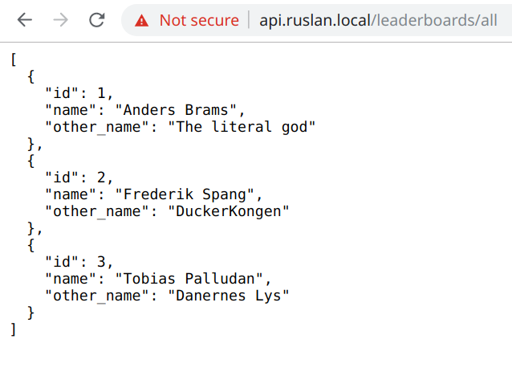

# Wolf of RUSLAN
Repository til alle underprojekter der bygges under RUSLAN 2019 Workshoppen. 


# Hvad skal det bruges til?
Vi har brugt vore studiestart på at skrive en børs til jer; *STONKS Stock Exchange*, den bedst performende og mest stabile exchange der findes. 
Alle grupper har deres egen service som de har fuld kontrol over. Service'en indeholder ét API endpoint, `Update()`, som vi kalder hvert 5. minut hvor vi giver jer al den aktieinformation vi har fra de sidste 5 minutter. Jeres job er at bruge denne aktieinformation til at købe og sælge aktier i STONKS Stock Exchange så I tjener flere penge end alle de andre grupper.

# How to use
*Denne guide virker kun for Mac OS X og Linux brugere - ikke Windows, sorry :-(*

*Hvis du bruger Windows anbefaler vi varmt at du kører en virtuel maskine med Ubuntu 18.04 LTS på (google VirtualBox) eller installerer en variant af Ubuntu ved siden af Windows som dualboot.*

Gør følgende for at kunne besøge `https://ruslan.local` og `https://api.ruslan.local` i din browser for at teste din service: 
## Installér Docker og Docker Compose
Kør `sudo sh scripts/install.sh` i terminalen. Prøv derefter at køre `docker --version` og `docker-compose --version` i terminalen. Hvis du i nogen af tilfældene ikke får et versionsnummer ud, men i stedet en "command not found" eller lignende fejlbesked er noget gået galt i installeringsprocessen. Dette kan normalt fixes ved at manuelt køre hver linje i `scripts/install.sh` hver for sig i terminalen.

## Installér Angular 7
Følg [denne guide](https://www.techomoro.com/how-to-install-and-setup-angular-7-on-ubuntu-18-04-1/) for at installere Angular.

## Generér SSL certifikater til lokal udvikling
Kør følgende kommandoer hver for sig: 
```
sudo sh scripts/cert-gen/gen_self_signed.sh ruslan.local
sudo sh scripts/cert-gen/gen_self_signed.sh api.ruslan.local
```

For at emulere server-tilstanden skal disse ligge i `/etc/letsencrypt/live`. Dette har du højst sandsynligt ikke endnu, da du nok ikke har brugt Let's Encrypt på din computer. Lav det med kommandoen:
```
sudo mkdir -p /etc/letsencrypt/live
```

Kopiér de to mapper ind i `/etc/letsencrypt/live/`: 

```
sudo mv scripts/cert-gen/api.ruslan.local /etc/letsencrypt/live
sudo mv scripts/cert-gen/ruslan.local /etc/letsencrypt/live
```

For at sikre, at SSL certifikaterne er blevet rykket korrekt, kør `ls /etc/letsencrypt/live` hvor outputtet burde være:
```
api.ruslan.local
ruslan.local
```
## Lad localhost pege på ruslan.local 
I din `/etc/hosts` fil skal du tilføje følgende to linjer i bunden: 
``` 
127.0.0.1     ruslan.local
127.0.0.1 api.ruslan.local
```

## Tillad debugging af Docker Containers
Hvis du bruger Visual Studio Code kan du lave "remote debugging" på din service imens den kører på din lokale server.
For at tillade dette, tilføj følgende til `launch.json` i VS Code:
```
// Allow the debugger to attach do a Docker container
{
    "name": ".NET Core Docker Attach",
    "type": "coreclr",
    "request": "attach",
    "processId": "${command:pickRemoteProcess}",
    "pipeTransport": {
        "pipeProgram": "docker",
        "pipeArgs": [ "exec", "-i", "NAVNET PÅ DIN SERVICE HER - KIG I docker-compose-local.yml - EKSEMPELVIS 'market-api' FOR AT DEBUGGE MarketService" ],
        "debuggerPath": "/vsdbg/vsdbg",
        "pipeCwd": "${workspaceRoot}",
        "quoteArgs": false
    }
}
```

## Log ind og ud 
Bare gør det.

## Kør serveren
Kør `sudo sh restart-local.sh`. 
Besøg herefter `https://ruslan.local`. Du vil se en advarselsbesked om usikkert SSL certifikat. Bypass denne, vi ved godt det ikke er ret rigtigt certifikat vi har genereret. 
Besøg herefter `https://api.ruslan.local` og gør det samme. 

For at besøge Leaderboards API'en, besøg `https://api.ruslan.local/leaderboards/all`. Hvis du får en JSON liste af personer virker alt som det skal. 




# FAQ 
## Jeg har ændret i `seed.sql` for min API, men der sker ikke noget med databasen
Databasens `seed.sql` bliver kun kørt når databasen laves. Da databasen allerede eksistere på disken køres det ikke. For at slette databasen kan du køre `sudo sh scripts/clean_docker.sh`. Bemærk at du mister al data i din database hvis du gør dette!
