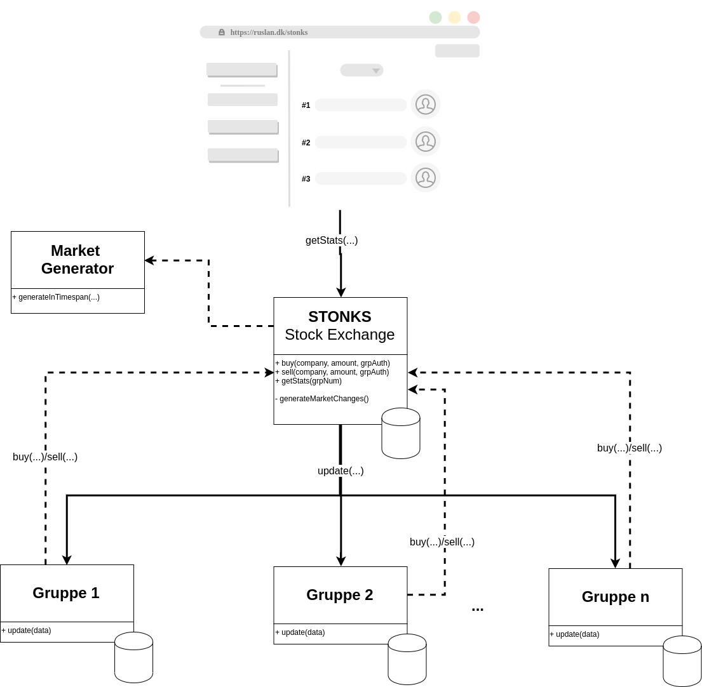

# RUSLAN Workshop
Repository til alle underprojekter der bygges under RUSLAN 2019 Workshoppen. 

Systemet bygges som en SOA arkitektur, og hvert underprojekt agerer således som sin egen isolerede service der leverer en API der kan anvendes af andre services. 



# Hvad skal det bruges til?
Overordnet skal systemet tilbyde en masse funktionaliteter der ville være brugbare i et stort LAN event som dette. 
Det inkluderer følgende: 
- [ ] Leaderboards - hvem er de bedste til hvert spil?
- [ ] Matchmaking - placér en spiller i en match hvor skill-level er optimalt passende
- [ ] Spilplanlægning - uden at tænke på skill-level, lav en round-robin spilplan
- [ ] Profiler - gør det muligt at oprette, ændre og slette egne profiler og se andres (søgefunktion)
- [ ] Eventstatistikker - hvor mange spiller lige nu i et givent spil? Hvor mange matches har der været? Vis en graf med antal samtidige spillere over tid
- [ ] Mere?

# Services
## Leaderboards
[Gruppe 1](LeaderboardService/)

## Matchmaking
[Gruppe 2](MatchmakingService/)

## Spilplanlægning
[Gruppe 3](TournamentService/)

## Profiler
[Gruppe 4](AccountService/)

## Eventstatistikker
[Gruppe 5](StatisticsService/)

# How to use
Gør følgende for at kunne besøge `https://ruslan.local` og `https://api.ruslan.local` i din browser for at teste din API: 
## Installér Docker og Docker Compose
Kør `sudo sh install.sh` i terminalen. Prøv derefter at køre `docker --version` og `docker-compose --version` i terminalen. Hvis du i nogen af tilfældene ikke får et versionsnummer ud, men i stedet en "command not found" eller lignende fejlbesked er noget gået galt i installeringsprocessen. Dette kan normalt fixes ved at manuelt køre hver linje i `install.sh` hver for sig i terminalen.
## Generér SSL certifikater
Kør `sudo sh generate_certs.sh`. 
## Lad loalhost pege på ruslan.local 
I din `/etc/hosts` fil skal du tilføje følgende to linjer i bunden: 
``` 
127.0.0.1     ruslan.local
127.0.0.1 api.ruslan.local
```
## Kør serveren
Kør `sudo sh restart-local.sh`. 
Besøg herefter `https://ruslan.local`. Du vil se en advarselsbesked om usikkert SSL certifikat. Bypass denne, vi ved godt det ikke er ret rigtigt certifikat vi har genereret. 
Besøg herefter `https://api.ruslan.local` og gør det samme. 

For at besøge Leaderboards API'en, besøg `https://api.ruslan.local/leaderboards/all`. Hvis du får en JSON liste af personer virker alt som det skal. 

# FAQ 
## Jeg har ændret i `seed.sql` for min API, men der sker ikke noget med databasen
Databasens `seed.sql` bliver kun kørt når databasen laves. Da databasen allerede eksistere på disken køres det ikke. For at slette databasen kan du køre `sudo sh scripts/clean_docker.sh`. Bemærk at du mister al data i din database hvis du gør dette!
